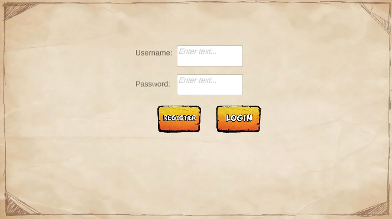
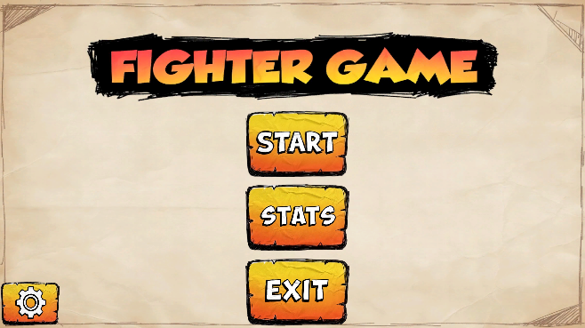
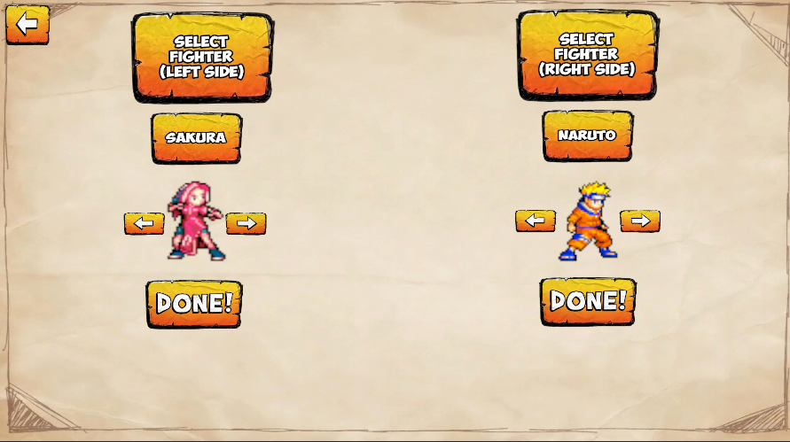
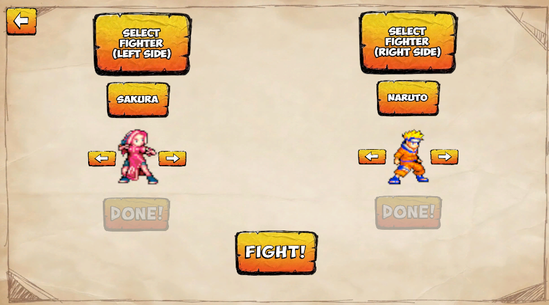

# Stickman Arena

> Joc de lluita 2D amb combat tècnic, moviment avançat i selecció de personatges.
---

## Característiques Principals
* **Combat Tècnic:** Sistema de lluita 2D amb atacs lleugers, pesats, bloqueig i dash.
* **Moviment Precís:** Salts, caiguda ràpida i orientació automàtica cap al rival.
* **Dash Avançat:** Doble pulsació per desplaçaments ràpids cap endavant o cap enrere.

---

## Guia de Controls

A continuació es mostren els controls oficials del joc, separats per jugador.

### Player 1

| Acció | Tecla |
| :--- | :--- |
| **Moure’s** | `A` `D` |
| **Saltar** | `W` |
| **Caiguda ràpida** | `S` |
| **Atac lleuger** | `J` |
| **Atac pesat** | `K` |
| **Bloqueig** | `B` |
| **Dash endavant** | `D` dues vegades |
| **Dash enrere** | `A` dues vegades |

### Player 2

| Acció | Tecla |
| :--- | :--- |
| **Moure’s** | `←` `→` |
| **Saltar** | `↑` |
| **Caiguda ràpida** | `↓` |
| **Atac lleuger** | `N` |
| **Atac pesat** | `M` |
| **Bloqueig** | `.` |
| **Dash endavant** | `→` dues vegades |
| **Dash enrere** | `←` dues vegades |

---

## Com Començar

1. Executa el joc.

2. Si no tens un compte, pots crear‑ne un des del menú de registre.

   

3. Si ja tens compte o ja t’has registrat, inicia sessió des del mateix menú.

   

4. Un cop hagis entrat, et trobaràs amb el menú principal del joc, des d’on podràs començar una partida, consultar estadístiques o accedir a les opcions.
   
   

5. Si decideixes començar a jugar, entraràs al menú de selecció de personatges.  
   Per seleccionar el teu lluitador, prem **Done!**

   

6. Quan tots dos jugadors hagin premut **Done!**, prem **Fight!** i ja podeu començar la lluita!

   

---

## Tutorial bàsic

### Moviment

Pots moure’t horitzontalment amb les tecles assignades al teu jugador.  
El personatge s’orienta automàticament cap a l’enemic.

### Salt i Caiguda Ràpida

Salta amb la tecla corresponent i utilitza la caiguda ràpida per descendir més ràpidament.

### Atacs

Els atacs lleugers i pesats permeten crear combos i pressionar el rival.

### Bloqueig

Mantén la tecla de bloqueig per defensar‑te.  
El bloqueig només funciona si estàs a terra i tens resistència disponible.

### Dash

Realitza un dash prement dues vegades ràpid la direcció cap endavant o cap enrere.  
És útil per apropar‑te, escapar o mantenir la pressió.

---

### Dash (amb temps de recuperació)
El dash és un moviment ràpid que et permet avançar o retrocedir de cop.
Després de fer-ne un, el personatge necessita un petit temps de recuperació abans de poder-ne fer un altre.
Això evita que puguis fer dash de manera contínua i manté el combat equilibrat.

### Bloqueig (consum i recuperació)
Quan prems el botó de bloqueig, el personatge es protegeix dels atacs.
Cada vegada que comences a bloquejar, es consumeix una part inicial de la barra de bloqueig.
Mentre mantens el bloqueig, la barra es va drenant de manera gradual.
Quan deixes de bloquejar, la barra es recupera sola fins a tornar al màxim.

### Block Cancel
Els atacs pesats deixen el personatge exposat si fallen, fent que durant un instant no et puguis defensar.
Si prems bloqueig just després d’un atac pesat fallat, pots cancel·lar aquesta vulnerabilitat.
Fer un block cancel consumeix una part de la barra de bloqueig, així que cal utilitzar-lo amb precisió.

### BackJump
Quan et mous cap enrere caminant, el personatge es desplaça més lentament.
En canvi, si saltes cap enrere, el moviment és més ràpid, però amb un risc important:
durant el salt no pots bloquejar, així que quedes exposat als atacs rivals.
És una eina útil per escapar, però cal utilitzar-la amb cura.

## Requisits del Sistema
* **SO:** Windows 10 o superior / macOS / Linux  
* **Processador:** Dual Core 2.0 GHz  
* **Memòria:** 2 GB de RAM  
* **Gràfics:** GPU integrada suficient  

---

## Llicència
Aquest projecte està sota la Llicència MIT.
